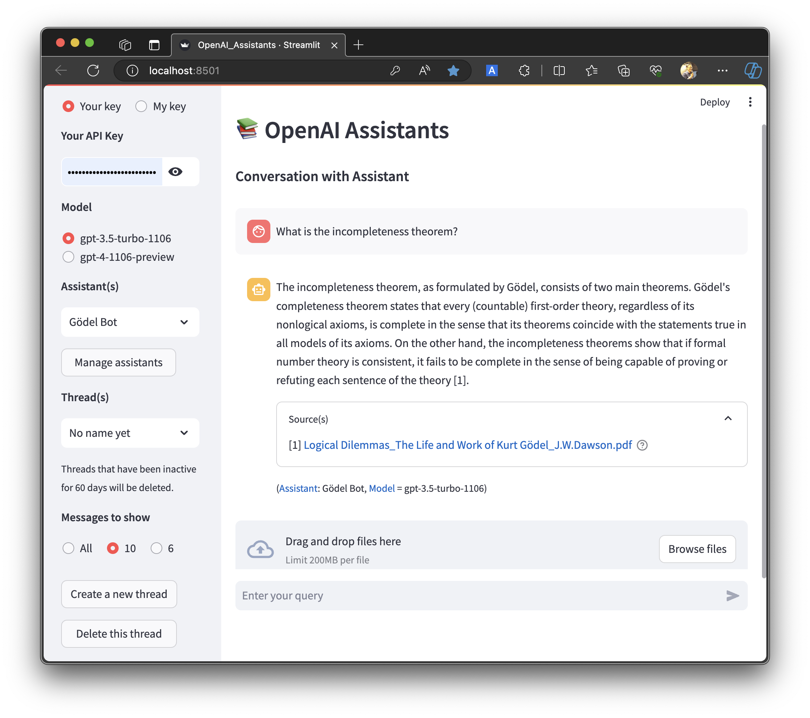

# [OpenAi Assistants](https://assistants.streamlit.app/)

* This app presents OpenAI assistants using OpenAI's Assistants API
  
  - Users can create their own custom chat bots or assistants using the tools
    :blue[retrieval], :blue[code_interpreter], and :blue[tavily_search]
    by function calling.

  - Assistants, threads, uploaded files and messages can be managed, enabling
    creation, modification and deletion.

  - Files generated by the assistants can be shown or downloaded.

  - The models "gpt-3.5-turbo-0125" or "gpt-4-0125-preview" can be used.

  - Voice recognition is supported.

* This page is written in python using the Streamlit framework.

* Your OpenAI API key is required to run this code. You can obtain an API key
  from https://platform.openai.com/account/api-keys.

## Usage
```python
streamlit run OpenAI_assistants.py
```
[](https://youtu.be/ACGFIIfF8EA)
